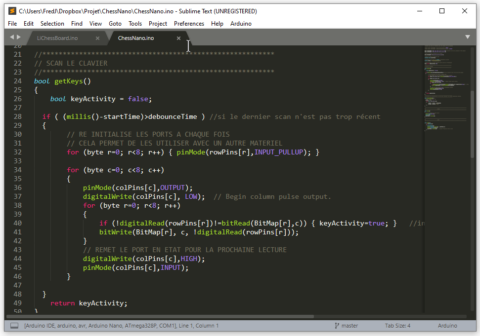

# ChessNano
ChessboARDuino with nano card  

 

Version minimum pour un chessboarduino  
permet de renvoyer via le port USB les signatures du plateau  

la pin 0 ne peut etre utilisée pour le clavier elle génère la réception de caractère aléatoire  
la pin 1 TX ne fonctionne pas  
les pin 20 et 21 ne fonctionnent pas directement  
(la pin 13 fonctionne en entrée avec une résistance de 10K en pull up) <= plus certain a vérifier  

